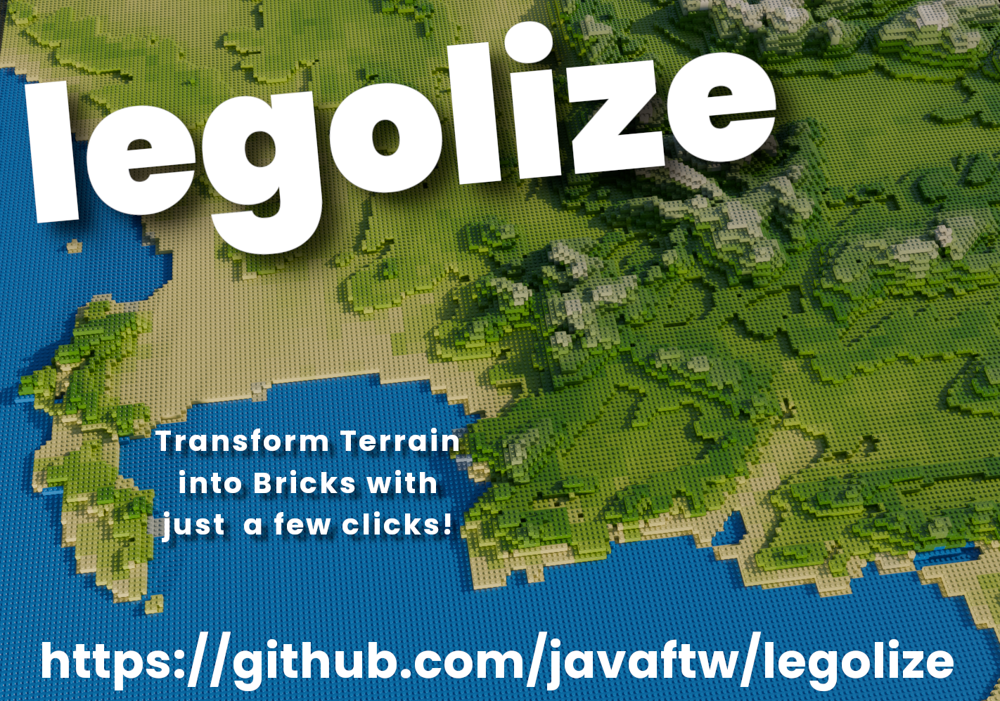

# Legolize

Transform Terrain into Bricks

**legolize** is a Blender add-on that converts QGIS-exported terrain data into a stylized brick landscape.

## Installation and Usage

1. In QGIS:
   - Ensure you have a DEM layer and a color layer.
   - Create a new print layout with a square map.
   - Select the DEM layer and ensure it's visible in the print layout.
   - Save the image as "displacement.png" in your installation directory.
   - Make the color layer visible and ensure it's correctly positioned.
   - Save this image as "color.png" in the same installation directory.

2. Download the `legolize.py` file to your installation directory.

3. In Blender:
   - Open Blender, select and delete the default cube.
   - Go to the Scripting workspace.
   - Load and run the `legolize.py` file.
   - Switch back to the Modeling or Layout workspace.
   - Open the sidebar (N key) to see the Legolize panel.
   - Adjust settings as desired.
   - Click "Legolize!" to generate the brick landscape.
   - Render your scene.

To update with new terrain:
- Return to QGIS and repeat steps to export new "displacement.png" and "color.png" images.
- In Blender, simply click "Legolize!" again to update with the new terrain data.